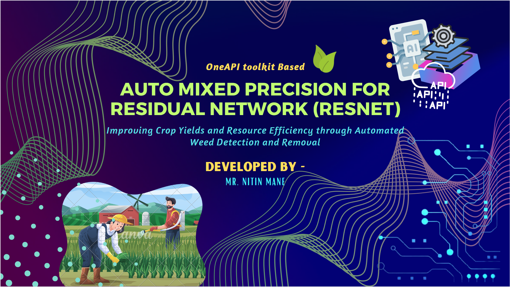

# Automated Weed Detection and Removal in Agricultural Fields

[](https://www.python.org/downloads/release/python-380/)
[](https://www.anaconda.com/)
[](https://software.intel.com/en-us/oneapi)
[](https://www.tensorflow.org/install)
[](https://scikit-learn.org/stable/install.html)
[](https://software.intel.com/en-us/oneapi-onedal-library)

 

## Computer Vision Challenge Track: Target and Eliminate

### Problem:

Weeds to increase crop yields Weeds are an unwanted intruder in the agricultural business. They steal nutrients, water, land, and other critical resources to grow healthy crops. These intruders can lead to lower yields and inefficient deployment of resources by farmers. One known approach is to use pesticides to remove weeds, but aggressive pesticides create health risks for humans. Computer vision technology can automatically detect the presence of weeds and use targeted remediation techniques to remove them from fields with minimal environmental impact.

### Expected Solution:

In this hackathon track, you will be tasked with training and deploying a model into a simulated production environment - where your binary-classification accuracy (F1 score) and inference time will be used to rank you against other teams competing for this track's top spot.

## Objective

The objective of this project is to develop a computer vision model that can accurately detect and remove weeds in agricultural fields with minimal environmental impact. The proposed approach uses a Residual Network (ResNet) architecture with Auto Mixed Precision (AMP) to classify images of crops and weeds. The use of AMP allows for dynamic adjustment of the precision of computations during training and inference, which can improve the performance of the model. The use of oneAPI Analytical Toolkit will enhance the performance and efficiency of the model, leading to improved crop yields and more efficient use of resources.

## Implementation

The implementation of this project will involve the following steps:
1. Collect and label a dataset of images of crops and weeds from real-world environments.
2. Use the oneAPI Data Analytics Library (DAL) to preprocess the dataset and prepare it for training.
3. Train a ResNet with AMP to classify images as either crops or weeds.
4. Optimize the model's performance using the oneAPI Math Kernel Library (MKL) and oneAPI Graph Analytics Library (GAL)
5. Use the oneAPI Model Analyzer and Debugger (MAD) to analyze the model's performance and identify any areas for  improvement.
6. Deploy the trained model to a simulated production environment using the oneAPI Deployment Manager.
7. Use the oneAPI Performance Profiler to monitor the model's runtime performance and identify any bottlenecks that may be impacting its performance.
8. Continuously monitor the model's performance and make updates as needed to improve its accuracy.


## Requirements

    • Intel TensorFlow 2.9 - 2.11 

    • oneAPI Analyticals toolkit

    • OpenCV

    • Python >= 3.7

    • NumPy

    • Pandas

    • Matplotlib

## Installation

1.	Install the deep learning framework by following the instructions on the official website ([TensorFlow](https://www.intel.com/content/www/us/en/developer/articles/guide/optimization-for-tensorflow-installation-guide.html))
2.	Install oneAPI toolkit by following the instructions on the official website
3.	Install OpenCV and other required python libraries using pip:

    Copy the code
    ```
    pip install opencv-python pip install numpy pip install pandas pip install matplotlib 
    ```

# Installation in the WSL2 Ubuntu 22.04 

## Installation of Intel Graphics Package Repository
To install the repositories.intel.com/graphics package repository, you can follow these steps:

1. Open your WSL 2 console.
2. Execute the following command to install the necessary dependencies:
```
sudo apt-get install -y gpg-agent wget

```
3. Execute the following command to download and install the GPG key:
```
wget -qO - https://repositories.intel.com/graphics/intel-graphics.key | sudo gpg --dearmor --output /usr/share/keyrings/intel-graphics.gpg

```
4. Execute the following command to add the repository to your system:
```
echo 'deb [arch=amd64,i386 signed-by=/usr/share/keyrings/intel-graphics.gpg] https://repositories.intel.com/graphics/ubuntu jammy arc' | sudo tee  /etc/apt/sources.list.d/intel.gpu.jammy.list

```
Follow the [link](https://www.intel.com/content/www/us/en/docs/oneapi/installation-guide-linux/2023-0/configure-wsl-2-for-gpu-workflows.html) for the installation instructions. 

## Enabling Intel Extension for TensorFlow

Setup environment variables
```
source /opt/intel/oneapi/setvars.sh
```

Install the latest Tensorflow and Intel Extension 

```
pip install tensorflow==2.10.0
pip install --upgrade intel-extension-for-tensorflow[gpu]
```

## Usage

1.	Clone the repository:
```
    git clone https://github.com/Nitin-Mane/Automated-Weed-Detection.git 
```
2.	Download the dataset and place it in the project folder.
```
    !wget <Dataset link>
```
follow the [Baseline](./02_Baseline.ipynb) notebook file for the download and data processing method.

3.	Use the oneAPI DAL to preprocess the dataset
```
    Initialize - C:/Program Files (x86)/Intel/oneAPI/setvars.bat | Visual Studio 2022 Community
```

4.	Train the model using the deep learning framework with AMP and oneAPI DNNL. The model trained are available in the following [link](https://mega.nz/folder/FoElCQAb#zCNPsFu6HRTrMF90ekF71g)

5.	Optimize the model's performance using oneAPI MKL and GAL

6.	Analyze the model's performance using oneAPI MAD

7.	Deploy the model to the simulated production environment using oneAPI Deployment Manager

8.	Monitor the model's performance using oneAPI Performance Profiler


# License

This project is licensed under the MIT License - see the LICENSE file for details.
